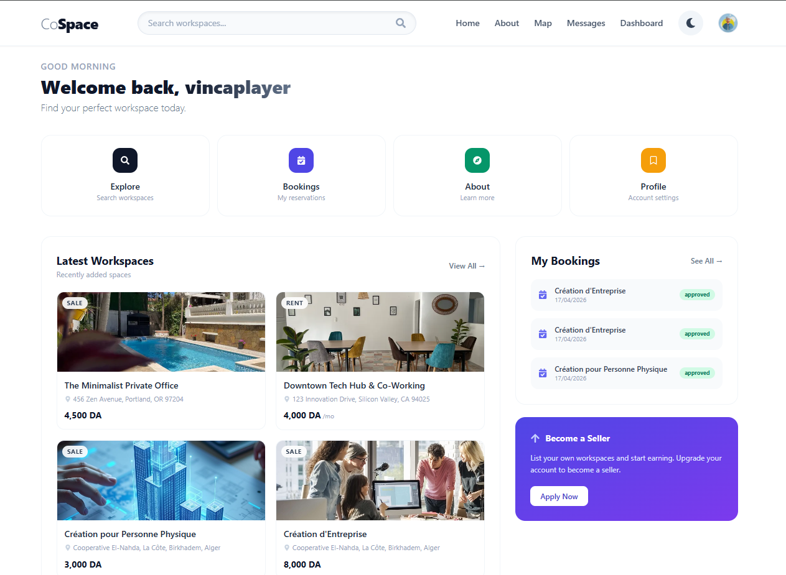

# 🏢 CoSpace - Premium Coworking Marketplace

  

**CoSpace** is a high-performance, real-time marketplace for coworking spaces built with the MERN stack. It features a stunning administrative dashboard, sophisticated financial analytics, and a seamless real-time messaging system.

---

## ✨ Features

- **🚀 Real-Time Ecosystem**: Instant booking notifications, message status updates, and live dashboard refreshes powered by Socket.io.
- **📊 Advanced Analytics**: Dynamic financial charts for Sellers and Admins with "Today", "Week", "Month", and "Year" views.
- **🛡️ Multi-Role Security**: Secure authentication and role-based access for Clients, Sellers (Owners), and Administrators.
- **💬 Integrated Messaging**: A custom-built messaging system with read receipts and real-time delivery.
- **🎨 Premium UI/UX**: A modern, glassmorphic design system using React and Ant Design for a state-of-the-art feel.
- **📑 Detailed Listings**: Search and filter workspaces with advanced geolocation and category tagging.

---

## 🛠️ Tech Stack

### Frontend
- **React.js** - UI Framework
- **Redux Toolkit** - State Management
- **Socket.io-client** - Real-time Sync
- **Ant Design** - Premium Component Library
- **Vanilla CSS / Modules** - Custom High-End Styling

### Backend
- **Node.js & Express** - Server Environment
- **MongoDB & Mongoose** - Database & ODM
- **Socket.io** - Web Socket Server
- **JWT & Cookie-Parser** - Secure Authentication
- **Helmet & Mongo-Sanitize** - Hardened Security Middleware

---

## 📸 Screenshots

> [!NOTE]
> Add your application screenshots here for a professional showcase.

| Dashboard Overview | Real-time Messaging | Financial Analytics |
| :--- | :--- | :--- |
|  |  |  |

---

## 🚀 Getting Started

Follow these steps to get your local development environment running.

### 📋 Prerequisites
- **Node.js** (v18 or higher)
- **MongoDB** (Local instance or Atlas Cluster)
- **Git**

### 🔧 Installation

1. **Clone the repository**
   ```bash
   git clone https://github.com/your-username/co-working-spaces-mern.git
   cd co-working-spaces-mern
   ```

2. **Install Dependencies**
   ```bash
   # Install Backend dependencies
   npm install

   # Install Frontend dependencies
   cd client
   npm install
   cd ..
   ```

3. **Environment Setup**
   Create a `.env` file in the root directory and add the following:
   ```env
   PORT=3001
   MONGO=your_mongodb_connection_string
   JWT_SECRET=your_super_secret_key
   ```

4. **Run the Application**
   Open two terminals or use the root dev script:
   ```bash
   # From the root directory (Runs both Backend & Frontend)
   npm run dev
   ```

---

## 📦 Project Structure

```text
├── api/                # Express backend & Socket server
│   ├── controllers/    # Business logic
│   ├── models/         # Database schemas
│   ├── routes/         # API endpoints
│   └── index.js        # Server entry point
├── client/             # React frontend
│   ├── src/
│   │   ├── components/ # Reusable UI components
│   │   ├── pages/      # Dashboard and page views
│   │   └── context/    # Socket & Global state
└── package.json        # Main configuration
```

---

## 👤 Author

**Wassim Mahdjoubi**
- Website: [Your Portfolio/Link]
- LinkedIn: [Your Profile]
- GitHub: [@wx2sim](https://github.com/wx2sim)

---

## 📄 License

This project is licensed under the ISC License.

---

*Build with ❤️ by Wassim Mahdjoubi*
